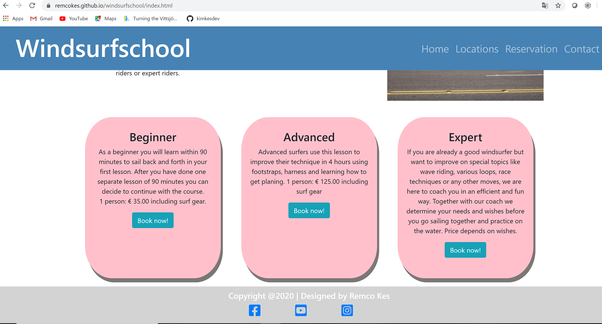

# Windsurfschool
This website is designed for windsurfers who want to learn windsurfing. Also there are advanced lessons or expert lessons. This is possible on 2 locations Zandvoort and Scheveningen.

This website consists of the following sections:
<ol>
    <li><strong>Home</strong> – this section provides the Windsurfschool information
    <li><strong>Locations</strong> – this section provides the 2 locations
    <li><strong>Reservation</strong> – here you can make a reservation 
 <li><strong>Contact</strong> – here you fill in a contact form</ol>

## Demo 
Website demo available <a href="https://windsurfschool.remcokes.repl.co/index.html ">here</a>.
  

# UX Design
I wanted to create a user friendly website with all the information that you need to do a windsurf lesson reservation.

## User Stories
<strong>User Story 1:</strong> People who want to start learning windsurfing
  
<strong>User Story 2:</strong> Some advanced windsurfer who want to learn windsurfing using board footstraps   
<strong>User Story 3:</strong> Some advanced windsurfer who want to learn windsurfing with harness lines
  
<strong>User Story 4:</strong> Good windsurfers who want to learn tricks like wave riding
  
<strong>User Story 5:</strong> Good windsurfers who want to learn loops  
<strong>User Story 6:</strong> Good windsurfers who want to learn race techniques
  
<strong>User Story 7:</strong> Good windsurfers who want to bring his or her skills to a next level 

## Strategy
The goal for this website is inform starting, advanced or expert windsurfs what lessons we offer on 2 locations.

## Scope
General information, windsurf lessons,  locations, reservations, contact and social media links.

## Structure
<ul>
    <li><strong>Header</strong> with the title and a menu
    <li><strong>Home</strong> information about the windsurfschool and the 3 possible lesson offers
    <li><strong>Locations</strong> information about the 2 locations where you could get a lesson
    <li><strong>Reservation</strong> reservation form
    <li><strong>Contact</strong> contact form
</ul>

## Skeleton
<ul>
    <li><strong>Header</strong>  
    The header is responsive to small, medium and large devices.
    <li><strong>Small and medium devices</strong>  
    On small and medium devices the title and a collapsible menu will be shown. 
    On small devices some pictures are smaller for a more user friendly website. 
    Each row will be shown vertical, for better readability.
    <li><strong>Large devices</strong>  
    On large devices the title and full menu will be shown. 
    Each row will be shown horizontal.
    <li><strong>Menu links</strong> 
     The menu links will link you to the right page on the website.
    <li><strong>Reservation form</strong> 
    The reservation form has required attributes which are needed for a windsurf lesson reservation.
    <li><strong>Contact form</strong> 
    The contact form has required attributes which are needed before submitting the form.
    <li><strong>Footer</strong> 
    In the footer the social media links will be found, which are external links.
</ul>

## Mockups & Wireframes
<ul>
    <li> <a href=https://github.com/remcokes/windsurfschool/tree/master/assets/mockups/mockup_large.pdf>Large screen</a>
    <li> <a href=https://github.com/remcokes/windsurfschool/tree/master/assets/mockups/mockup_medium.pdf>Medium screen</a>
    <li> <a href=https://github.com/remcokes/windsurfschool/tree/master/assets/mockups/mockup_small.pdf>Small screen</a>
</ul> 

# Technologies 

* __HTML__ was the language used to structure and present content for the web

* __CSS3__ was the language used in the styling and formatting the website content, to improve the UX.

* __GitPod__ was the cloud-based IDE used, to write, run, and debug code with the web browser and to create the website.

* __Bootstrap__ a front-end component library, that was used to build responsive, mobile-first projects on the website.
 
* __Chrome Developer Tools__ was used to ensure that the responsive design worked properly.
 
* __GitHub__ was used for version control, o have a working copy/snippet of the code and full change history on the local machine.

* __FontAwesome__ was the preferred library, for the icons used on the website

## Frameworks / Tools / Libraries
<ul>
    <li><a href="https://balsamiq.com/">Balsamiq</a> for the mockups.
    <li><a href="https://getbootstrap.com/">Bootstrap</a> for the collapsible navbar, button and the footer icons.
    <li><a href="https://fontawesome.com/">Fontawesome</a> for the link icons Facebook, Youtube, Instagram.
</ul>

## Testing
<ul>
    <li><a href="https://validator.w3.org/">HTML Validator</a> for testing the HTML code.
    <li><a href="https://jigsaw.w3.org/css-validator/">CSS Validator</a> for testing the CSS code.
</ul>  

## Testing results
<ul>
<li> <a href=https://github.com/remcokes/windsurfschool/tree/master/assets/readme_images/css_validator.PNG>CSS validator result</a>
<li> <a href=https://github.com/remcokes/windsurfschool/tree/master/assets/readme_images/html_checker_index.PNG>html index validator result</a>
<li> <a href=https://github.com/remcokes/windsurfschool/tree/master/assets/readme_images/html_checker_locations.PNG>html locations validator result</a>
<li> <a href=https://github.com/remcokes/windsurfschool/tree/master/assets/readme_images/html_checker_reservation.PNG>html reservation validator result</a>
<li> <a href=https://github.com/remcokes/windsurfschool/tree/master/assets/readme_images/html_checker_contact.PNG>html index contact result</a>
</ul>
Google Chrome Developer Tools for testing different device sizes.

# Testing information
Tested in multiple browser’s (Edge, Chrome, Firefox).  
And tested in multiple small and medium devices (Galaxy S5, Pixel 2, Pixel 2 XL, iPhone 6/7/8, iPhone 6/7/8 Plus, iPhone X, iPad, iPad Pro.)

# Deployment
I started working on this project in Repl.it because GitPod had an 50 hour time limit and I like working from Repl.it more.  
I used GitPod for backups and to publish my website for the Milestone project 1 
This website starts with the: index.html, followed by the map ‘assets’, with a map of ‘images’, ‘readme_images’, ‘css’.  
I used locations.html, for the locations page. 
I used reservation.html, for the reservation page. 
I used contact.html, for the contact page. 
In the ’css’ map you will find the page: style.css. 
A map called 'mockups' with small, medium and large wireframes. 
A map called ‘images' with the images. 
A map called ‘readme_images' with testing screenschots  
Ending with the README.md.

## New Repository
The following steps show how I created my website in GitHub and GitPod:
<ol>
    <li>In GitHub I clicked the green button with <strong>New</strong>, which creates a new repository;
    <li>I clicked the green button <strong>GitPod</strong>, to open my new repository in GitPod;
    <li>I added new folders and files by clicking <strong>File</strong>, followed by <strong>New Folder</strong> or <strong>New File</strong>;
    <li>When a part was finished, I selected <strong>File</strong>, and <strong>Save</strong> or Ctrl+s;
    <li>Than I clicked on <strong>Source Control: Git</strong>;
    <li>Followed by filling in the <strong>Message name</strong> for this commit;
    <li>Than I pressed on the <strong>+ icon</strong> to stage all changes;
    <li>On the top you see a <strong>V icon</strong>, which I clicked for the commit;
    <li>On the right side I clicked the cat icon which is called <strong>Pull Request</strong>;
    <li>A collored pop-up shown with a blue button <strong>Push</strong>, which I clicked on, to push the commit to GitHub;
    <li>In GitHub I can see all my folders and files with the Message name of my last changes.
</ol>

## Deployment in GitHub
The following steps show how my website was deployed in GitHub:
<ol>
    <li>I logged in to <strong>GitHub</strong> and selected my repository;
    <li>I clicked on the tab <strong>Settings</strong>;
    <li>I scrolled down to the <strong>GitHub Pages</strong> section;
    <li>On the Select source drop-down menu I selected <strong>master branch</strong> as my GitHub Pages publishing source;
    <li>Then I clicked <strong>Save</strong>.
</ol>
The deployed site will update automatically upon new commits to the master branch.  
Note: the landing page must be named index.html.

## Clone and contribute
The following steps show how you can clone my repository:
<ol>
    <li>In GitHub go to <a href="https://remcokes.github.io/windsurfschool/">windsurfschool</a>;
    <li>Press the <strong>Fork</strong> button on the right top of the page, to create a copy of the repository in your own GitHub account;
    <li>On your GitHub account, open the forked repository and click on the green <strong>Clone or Download</strong> button;
    <li>In the Clone with HTTPS section you can copy the repository url;
    <li>Open the terminal of your IDE;
    <li>Type <strong>Git Clone</strong> into the location where you want this website to be cloned;
    <li>Paste the copied url in step 3;
    <li>Your local repository will be created when you press <strong>enter</strong>;
    <li>Make the changes you want and push them to the <strong>Master Default branch</strong> with a good message name.
</ol>

## Media
The photos used in this website were obtained from 
<ul>
    <li><a href="https://www.pexels.com/photo/people-walking-3176048/ ">navbar_image</a>.
    <li><a href="https://www.stockvault.net/photo/185984/city-surf/ ">General_image</a>.
    <li><a href="https://pixabay.com/nl/photos/zandvoort-nederland-stad-stedelijke-82142/">Zandvoort</a>.
    <li><a href="https://unsplash.com/photos/hRf79CdmdXk/ ">Scheveningen</a>.
    <li><a href="https://www.pexels.com/photo/man-windsurfing-2534822/">reservations_form_image</a>.
    <li><a href="https://unsplash.com/photos/Wa-gS5R58gA">contact_form_image</a>.
    <li><a href="https://unsplash.com/photos/sXzuRmorw7o">locations_image</a>.
</ul>

## Acknowledgements
I used a lot of general knowledge from <a href="https://www.w3schools.com">w3schools</a>.
